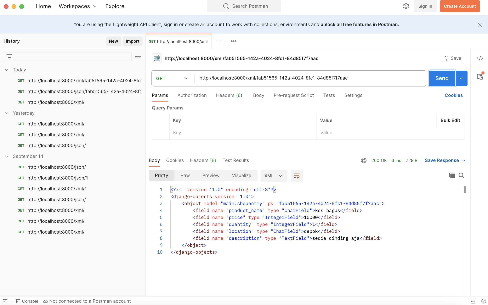
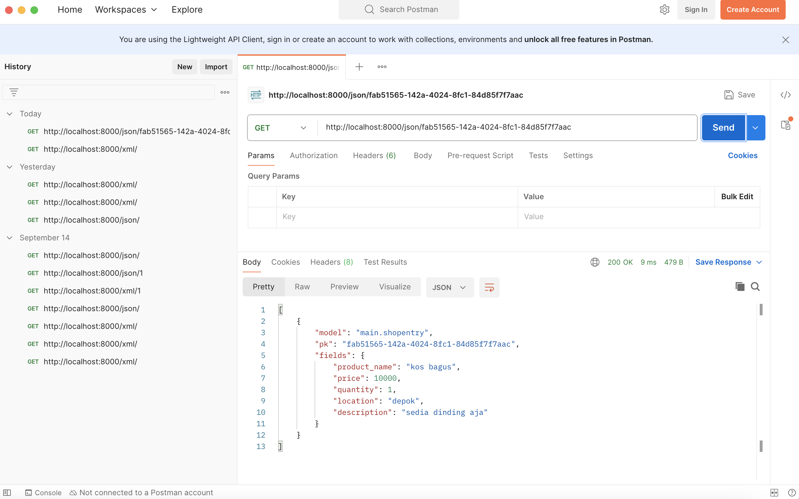

# YuKita

**Tugas Pemrograman Berbasis Platform - PBP B**

> **YuKita** merupakan proyek Django sederhana berbentuk e-commerce berbasis website untuk memenuhi Tugas Individu mata kuliah PBP Gasal 2024/2025

[ 🏠 Kunjungi Website YuKita 🏠 ](http://gnade-yuka-yukita.pbp.cs.ui.ac.id/)

## **Penjelasan Tugas**

<details>
<summary> <b> Tugas 2: Implementasi Model-View-Template (MVT) pada Django </b> </summary>

## **Implementasi Checklist**

* ### Inisiasi Proyek Django

Setelah saya membuat direktori baru dengan nama Yukita, nama e-commerce buatan saya, saya membuat dependencies pada berkas 'requirements.txt' yang berisi

```
django
gunicorn
whitenoise
psycopg2-binary
requests
urllib3
```

Lalu melakukan instalasi dependencies setelah menjalankan virtual environment dengan perintah `pip install -r requirements.txt` dan membuat proyek Django dengan perintah `django-admin startproject yukita .`

* ### Menjalankan Server

Setelah membuat proyek Django, saya menambahkan string `ALLOWED_HOSTS = ["localhost", "127.0.0.1"]` untuk keperluan deployment dan menjalankan server Django dengan perintah `python3 manage.py runserver`

* ### Membuat  aplikasi `main`

Saya menjalankan perintah `python manage.py startapp main` untuk membuat aplikasi baru bernama main. Lalu saya menambahkan `main` ke `INSTALLED_APPS` pada berkas `settings.py` 


* ### Membuat model aplikasi `main`

Saya membuat berkas `models.py` pada direktori `main` yang berisikan

```
from django.db import models

class ShopEntry(models.Model):
    name = models.CharField(max_length=255)
    price = models.IntegerField()
    description = models.TextField()
    quantity = models.IntegerField()
    location = models.CharField(max_length=255)

    @property
    def is_avaible(self):
        return self.quantity > 0
```

Lalu saya mengimigrasikan model yang sudah saya buat dengan menjalankan perintah `python3 manage.py makemigrations` dan mengimigrasikannya ke basis data lokal dengan menjalankan perintah `python manage.py migrate`

* ### Membuat template dan view aplikasi `main`

Template untuk merender pada file `views.py` berisikan

```
from django.shortcuts import render

def show_main(request):
    context = {
        'product_name': 'BLAHAJ Soft Toy',
        'product_price': 'IDR 299,000',
        'product_description': 'A large and soft cuddly shark. It\'s perfect to hug, use as a pillow, or play with. This toy will bring comfort and joy to any child.',
        'product_quantity': 1,
        'product_location': 'Jakarta, Surabaya, Bali',
        'name' : "Gnade Yuka",
        'kelas' : "PBP-B"
    }

    return render(request, "main.html", context)

```

dan template pada file `html.main` berisi 

```
<h1>YuKita</h1>

<h5>Nama: </h5>
<p>{{ name }}</p>

<h5>Kelas: </h5>
<p>{{ kelas }}</p>

<h1>{{ product_name }}</h1>

<h5>Price: </h5>
<p>{{ product_price }}</p>

<h5>Description: </h5>
<p>{{ product_description }}</p>

<h5>Quantity: </h5>
<p>{{ product_quantity }}</p>

<h5>Location: </h5>
<p>{{ product_location }}</p>
```

* ### Melakukanrouting pada aplikasi `main`

Untuk mengatur URL pada aplikasi `main`, saya membuat berkas `urls.py` pada aplikasi `main` berisikan

```
from django.urls import path
from main.views import show_main

app_name = 'main'

urlpatterns = [
    path('', show_main, name='show_main'),
]
```

Dengan begitu, saya dapat melihat `main` dengan perintah `python manage.py runserver`

## **Jawaban Tugas 2**

* ### Bagan request client ke web aplikasi berbasis Django


Client (Browser/User) mengirimkan request HTTP ke server, yang kemudian memprosesnya dengan melakukan pemetaan URL melalui urls.py. Setelah URL ditemukan dan dipetakan, fungsi yang sesuai dalam views.py dijalankan berdasarkan permintaan URL tersebut. Selanjutnya, fungsi view mengembalikan HTTP response dalam bentuk halaman HTML. Dalam proses ini, views.py mengambil data yang dibutuhkan dari models.py, lalu data tersebut disajikan menggunakan template main.html.


* ### Fungsi `git` dalam pengembangan perangkat lunak

Git adalah sistem pengontrol versi terdistribusi yang sangat penting dalam pengembangan perangkat lunak. Fungsinya mencakup pelacakan perubahan kode, memungkinkan kolaborasi antar-pengembang, dan mendukung pengelolaan proyek berskala besar. Dengan Git, pengembang dapat membuat cabang kode (branches) untuk mengembangkan fitur baru secara paralel tanpa mengganggu kode yang sudah ada. Setelah pengembangan selesai, perubahan dapat digabungkan (merge) kembali ke cabang utama. Selain itu, Git memungkinkan pengembalian (rollback) ke versi sebelumnya jika terjadi kesalahan.

* ### Mengapa framework Django dijadikan permulaan pembelajaran pengembangan perangkat lunak?

Django sering kali dipilih sebagai framework pertama untuk belajar pengembangan perangkat lunak karena strukturnya yang jelas dan lengkap. Django menyediakan "batteries included," yang berarti banyak fungsi umum seperti autentikasi, manajemen database, dan URL routing sudah tersedia secara default, memudahkan pemula untuk fokus pada konsep dasar. Selain itu, Django menggunakan bahasa Python, yang terkenal dengan sintaks yang mudah dipahami,sehingga cocok untuk pelajar dan pengembang pemula.

* ### Mengapa model pada Django disebut sebagai ORM?

Pada Django, model disebut sebagai ORM (Object-Relational Mapping) karena menyediakan cara untuk menghubungkan dan memanipulasi data di database menggunakan objek Python. ORM memungkinkan pengembang berinteraksi dengan database tanpa harus menulis SQL secara langsung. Setiap model di Django merepresentasikan tabel di database, dan setiap atribut model merepresentasikan kolom pada tabel tersebut. Dengan menggunakan ORM, pengembang dapat melakukan operasi database seperti penyimpanan, update, dan penghapusan data dengan kode Python yang lebih mudah dibaca.


</details>

<details>
<summary> <b> Tugas 3: Implementasi Form dan Data Delivery pada Django</b> </summary>

## **Jawaban Tugas 3**

* ### Mengapa kita memerlukan data delivery dalam pengimplementasian sebuah platform?
**Data delivery** dalam pengimplementasian sebuah platform diperlukan karena bertujuan untuk memastikan bahwa data yang dikirim antar bagian sistem (misalnya, antara frontend dan backend atau antar microservices) dapat ditukar dengan cara yang efisien, aman, dan konsisten. Tanpa mekanisme pengiriman data yang efektif, aplikasi tidak akan dapat menyajikan informasi yang tepat kepada pengguna secara real-time, menyebabkan pengalaman pengguna yang buruk. Selain itu, data delivery memungkinkan platform untuk beroperasi secara terdistribusi, mendukung skala besar, serta memfasilitasi komunikasi antar komponen yang berbeda secara seamless.

* ### Mana yang lebih baik antara XML dan JSON? Mengapa JSON lebih populer dibandingkan XML?
Antara **XML** dan **JSON**, **JSON** lebih baik dan populer untuk pengiriman data dalam aplikasi modern. Hal ini karena JSON lebih ringan dan lebih mudah dibaca oleh manusia maupun mesin dibandingkan XML, yang menggunakan tag berlapis dan lebih verbose. JSON juga lebih mudah diolah dengan JavaScript, yang merupakan bahasa umum di web development. Sementara XML memiliki kemampuan untuk mendeskripsikan struktur data yang lebih kompleks (seperti metadata dan skema yang dapat divalidasi), JSON tetap lebih disukai untuk API modern karena kecepatan dan kesederhanaannya. Oleh karena itu, JSON lebih populer karena performanya yang lebih efisien dalam konteks pengiriman data di web.

* ### Jelaskan fungsi dari method is_valid() pada form Django dan mengapa kita membutuhkan method tersebut?
Dalam **Django**, method **`is_valid()`** digunakan pada objek form untuk memeriksa apakah data yang dikirimkan oleh pengguna sesuai dengan aturan validasi yang telah ditentukan dalam form tersebut. Method ini akan mengembalikan nilai `True` jika semua data valid dan `False` jika terdapat kesalahan dalam input pengguna. Kita membutuhkan method ini agar data yang diterima dari pengguna dapat diproses dengan benar atau menampilkan pesan kesalahan jika data yang dimasukkan tidak sesuai dengan ketentuan (misalnya format email salah atau ada field yang tidak diisi). Tanpa validasi ini, aplikasi rentan menerima data yang tidak lengkap atau tidak valid.

* ### Mengapa kita membutuhkan csrf_token saat membuat form di Django? Apa yang dapat terjadi jika kita tidak menambahkan csrf_token pada form Django? Bagaimana hal tersebut dapat dimanfaatkan oleh penyerang?
Kita membutuhkan **`csrf_token`** saat membuat form di Django untuk melindungi aplikasi dari serangan **Cross-Site Request Forgery (CSRF)**, yaitu jenis serangan di mana penyerang dapat membuat pengguna yang sudah login di aplikasi mengirimkan permintaan yang tidak diinginkan tanpa sepengetahuan mereka. Jika form Django tidak memiliki **`csrf_token`**, penyerang dapat memanfaatkan celah ini untuk melakukan tindakan berbahaya, seperti mengirimkan permintaan palsu atas nama pengguna tanpa izin, yang bisa berdampak pada perubahan data atau eksploitasi lain. **`csrf_token`** membantu mencegah hal ini dengan memastikan bahwa permintaan yang dikirim ke server berasal dari sumber yang sah.

## **Implementasi Checklist**

* ### Membuat input form

Membuat `form` untuk menerima input, sehingga nantinya data baru bisa ditampilkan dengan membuat file `forms.py` pada main yang berisikan kode

```
from django.forms import ModelForm
from main.models import ShopEntry

class ShopEntryForm(ModelForm):
    class Meta:
        model = ShopEntry 
        fields = ["product_name", "price", "quantity", "location", "description"]
```

Selain itu, saya juga mengubah `show_main` pada `views.py` menjadi

```
def show_main(request):
    shop_entries = ShopEntry.objects.all()
    
    context = {
        # 'product_name': 'Sofa Ruang Tamu',
        # 'product_price': 'IDR 1,500,000',
        # 'product_description': 'A sofa-bed with small, neat dimensions which is easy to furnish with, even when space is limited. You can make the sofa more comfortable and personal by completing with pillows in different colours and patterns.',
        # 'stock': 1,
        # 'product_location': 'Jakarta, Surabaya, Bali',
        'name' : "Gnade Yuka",
        'kelas' : "PBP-B",
        'shop_entries' : shop_entries
    }

    return render(request, "main.html", context)
```

* ### Menambahkan fungsi pada `views.py`

Sehingga kita bisa melihat data yang sudah diinput

1. Membuat fungsi baru `create_shop_entry` pada `views.py` agar bisa menerima data yang berisikan

```
def create_shop_entry(request):
    form = ShopEntryForm(request.POST or None)

    if form.is_valid() and request.method == "POST":
        form.save()
        return redirect('main:show_main')

    context = {'form': form}
    return render(request, "create_shop_entry.html", context)
```

2. Lalu membuat template baru untuk tampilan ketika menambahkan pembelian baru dengan nama `create_shop_entry` pada direktori `main/templates` yang berisikan

```
 

<h1>Add New Shop Entry</h1>

<form method="POST">
  
  <table>
    {{ form.as_table }}
    <tr>
      <td></td>
      <td>
        <input type="submit" value="Add Shop Entry" />
      </td>
    </tr>
  </table>
</form>


```

3. Lalu menampilkan data pembelian dalam bentuk tabel dan menambahkan tombol `Add New Shop Entry` pada `main.html` ketika ingin menambahkan pembelian

```
<div class="shop-entries">
    <h3>Shop Entries</h3>
    
    
    <p>Belum ada pesanan yang masuk</p>
    
    <table>
      <tr>
        <th>Nama</th>
        <th>Harga</th>
        <th>Jumlah Kamar</th>
        <th>Lokasi</th>
        <th>Deskripsi</th>
      </tr>
      
      <!-- Display each shop entry -->
      
      <tr>
        <td>{{ shop_entry.product_name }}</td>
        <td>{{ shop_entry.price }}</td>
        <td>{{ shop_entry.quantity }}</td>
        <td>{{ shop_entry.location }}</td>
        <td>{{ shop_entry.description }}</td>
      </tr>
      
    </table>
    
</div>

<br />

<a href="">
  <button>Add New Shop Entry</button>
</a>
```

* ### Menambahkan format XML dan JSON 

Untuk melihat data dalam format XML dan JSON, pada `views.py` di foler `main` kita menambahkan 
```
from django.http import HttpResponse
from django.core import serializers
```

1. Menambahkan fungsi `show_xml` dan `show_xml_by_id` (untuk melihat bedasarkan filter ID) yang akan mengembalikan `HttpResponse` berisi data yang sudah menjadi XML

```
def show_xml(request):
    data = ShopEntry.objects.all()
    return HttpResponse(serializers.serialize("xml", data), content_type="application/xml")

def show_xml_by_id(request, id):
    data = ShopEntry.objects.filter(pk=id)
    return HttpResponse(serializers.serialize("xml", data), content_type="application/xml")
```

2. Menambahkan fungsi `show_json` dan `show_json_by_id` (untuk melihat bedasarkan filter ID) yang akan mengembalikan `HttpResponse` berisi data yang sudah menjadi JSON

```
def show_json(request):
    data = ShopEntry.objects.all()
    return HttpResponse(serializers.serialize("json", data), content_type="application/json")

def show_json_by_id(request, id):
    data = ShopEntry.objects.filter(pk=id)
    return HttpResponse(serializers.serialize("json", data), content_type="application/json")

```

3. Merouting URL
Tidak lupa juga untuk menambahkan `path_url` fungsi yang sudah kita tambhkan ke `urlpatterns` pada `main/urls.py` dan mengimport dari `views.py`. Sehingga isi dari `main/urls.py` akan berisi :

```
from django.urls import path
from main.views import show_main, create_shop_entry, show_xml, show_json, show_xml_by_id, show_json_by_id

app_name = 'main'

urlpatterns = [
    path('', show_main, name='show_main'),
    path('create-shop-entry', create_shop_entry, name='create_shop_entry'),
    path('xml/', show_xml, name='show_xml'),
    path('json/', show_json, name='show_json'),
    path('xml/<str:id>/', show_xml_by_id, name='show_xml_by_id'),
    path('json/<str:id>/', show_json_by_id, name='show_json_by_id'),
]
```

Sehingga, input `form` sudah bisa digunakan dengan menjalankan command `python3 manage.py runserver` dan mengunjungi <http://localhost:8000>.

## Postman *Screenshot*
1. XML

2. JSON

3. XML *by* ID

4. JSON *by* ID


</details>

<details>
<summary> <b> Tugas 4: Implementasi Autentikasi, Session, dan Cookies pada Django</b> </summary>

## **Jawaban Tugas 3**

* ### Apa perbedaan antara HttpResponseRedirect() dan redirect()?
HttpResponseRedirect() adalah kelas yang secara eksplisit mengembalikan respons HTTP yang mengarahkan pengguna ke URL tertentu, di mana kita harus memberikan URL tujuan secara manual. Sebaliknya, redirect() adalah shortcut yang lebih fleksibel dalam Django, yang dapat menerima tidak hanya URL, tetapi juga nama view atau objek model dan secara otomatis menangani pembuatan URL tujuan. Dengan redirect(), proses redirect menjadi lebih sederhana karena Django mengubah input yang diberikan menjadi URL yang sesuai.

* ### Jelaskan cara kerja penghubungan model Product dengan User!
Penghubungan antara model Product dengan User biasanya dilakukan menggunakan ForeignKey atau ManyToManyField tergantung pada hubungan yang diinginkan. Misalnya, jika satu pengguna bisa memiliki banyak produk, maka model Product akan memiliki ForeignKey ke model User, seperti ini: user = models.ForeignKey(User, on_delete=models.CASCADE). Ini berarti setiap instance Product terhubung dengan satu pengguna, tetapi satu pengguna dapat memiliki banyak produk. Django akan secara otomatis membuat relasi ini di database, dan kita dapat mengakses data yang terhubung melalui atribut relasi tersebut.
 
* ### Apa perbedaan antara authentication dan authorization, apakah yang dilakukan saat pengguna login? Jelaskan bagaimana Django mengimplementasikan kedua konsep tersebut.
Authentication adalah proses memverifikasi identitas pengguna, misalnya dengan memastikan username dan password yang diberikan benar. Authorization adalah proses yang menentukan apakah pengguna yang terautentikasi memiliki izin untuk melakukan aksi tertentu. Ketika pengguna login, mereka pertama-tama melewati proses authentication. Django mengimplementasikan authentication menggunakan django.contrib.auth, yang menyediakan sistem login, logout, dan manajemen pengguna. Authorization di Django diimplementasikan melalui sistem izin berbasis objek, di mana setiap pengguna dapat diberikan izin tertentu untuk mengakses fitur atau tindakan tertentu di aplikasi.

* ### Bagaimana Django mengingat pengguna yang telah login? Jelaskan kegunaan lain dari cookies dan apakah semua cookies aman digunakan?
Django mengingat pengguna yang telah login dengan menggunakan session cookies, yang disimpan di browser pengguna. Saat pengguna login, Django menyimpan session ID di cookie dan di database. Setiap kali pengguna mengakses halaman, Django memeriksa session ID untuk mengetahui apakah pengguna sudah login. Selain itu, cookies dapat digunakan untuk menyimpan preferensi pengguna atau melacak aktivitas. Tidak semua cookies aman digunakan; misalnya, cookies yang tidak diatur dengan aman dapat dicuri dalam serangan seperti cross-site scripting (XSS). Django menyediakan pengaturan seperti HttpOnly dan Secure untuk memastikan cookies lebih aman dengan membatasi akses JavaScript dan memaksa penggunaan HTTPS.

## **Implementasi Checklist**

* ### Membuat Form Registrasi

Agar website hanya bisa diakses oleh pengguna yang sudah mempunyai akun, maka diperlukan form untuk registrasi. Pada `views.py` kita menambahkan import `UserCreatiionForm` dan `message`. Selain itu saya juga menambahkan fungsi `register` agar bisa membuat form registrasi secara otomatis dan menghasilkan data setelah disubmit
```
from django.contrib.auth.forms import UserCreationForm
from django.contrib import messages

def register(request):
    form = UserCreationForm()

    if request.method == "POST":
        form = UserCreationForm(request.POST)
        if form.is_valid():
            form.save()
            messages.success(request, 'Your account has been successfully created!')
            return redirect('main:login')
    context = {'form':form}
    return render(request, 'register.html', context)
```

Selain itu saya juga membuat halaman registrasi pada `registrasi.html` pada `main/templates` dengan code 
```



    <title>Register</title>


  

<div class = "login">
    
    <h1>Register</h1>  

        <form method="POST" >  
              
            <table>  
                {{ form.as_table }}  
                <tr>  
                    <td></td>
                    <td><input type="submit" name="submit" value="Daftar"/></td>  
                </tr>  
            </table>  
        </form>

      
        <ul>   
              
                <li>{{ message }}</li>  
                  
        </ul>   
    

</div>  


```

Terakhir saya juga menambahkan url path pada `urls.py`
```
from main.views import register
 urlpatterns = [
     ...
     path('register/', register, name='register'),
 ]
```
* ### Membuat Fungsi Login

Setelah membuat form registrasi, saya juga membuat fungsi login untuk menerima user yang sudah terdaftar dengan menambahkan berikut ini ke dalam `views.py`
```
from django.contrib.auth.forms import UserCreationForm, AuthenticationForm
from django.contrib.auth import authenticate, login

def login_user(request):
   if request.method == 'POST':
      form = AuthenticationForm(data=request.POST)

      if form.is_valid():
            user = form.get_user()
            login(request, user)
            return redirect('main:show_main')

   else:
      form = AuthenticationForm(request)
   context = {'form': form}
   return render(request, 'login.html', context)
```
Selain itu, saya juga membuat halaman tampilan untuk login user dengan membuat `login.html` pada direktori `main/templates` yang berisi
```



<title>Login</title>



<div class="login">
  <h1>Login</h1>

  <form method="POST" action="">
    
    <table>
      {{ form.as_table }}
      <tr>
        <td></td>
        <td><input class="btn login_btn" type="submit" value="Login" /></td>
      </tr>
    </table>
  </form>

  
  <ul>
    
    <li>{{ message }}</li>
    
  </ul>
   Don't have an account yet?
  <a href="">Register Now</a>
</div>


```

Tidak lupa juga untuk mengimport fungsi yang sudah saya buat ke dalam `urls.py` dengan menambahkan path url
```
from main.views import login_user
urlpatterns = [
   ...
   path('login/', login_user, name='login'),
]
```
* ### Membuat Fungsi Logout

Selain membuat fungsi login, diperlukan fungsi logout dengan menambahkan potongan kode berikut ke dalam `views.py`

```
from django.contrib.auth import logout

def logout_user(request):
    logout(request)
    return redirect('main:login')
```
selain itu pada `main.html` juga kita tambahkan 
```
<a href="">
  <button>Logout</button>
</a>
```
untuk mengarahkan halaman url secara dinamis. Tidak lupa juga untuk mengimport fungsi yang sudah saya buat ke dalam `urls.py` dengan menambahkan path url
```
from main.views import logout_user
urlpatterns = [
   ...
   path('logout/', logout_user, name='logout'),
]
```

* ### Meretriksi Halaman Main

pada `views.py` kita tambahkan
```
from django.contrib.auth.decorators import login_required
@login_required(login_url='/login')
def show_main(request):
```
* ### Menerapkan Cookies

Untuk menampilkan data last login pengguna, kita bisa menggunakan cookies. Pada `views.py` kita tambahkan
```
import datetime
from django.http import HttpResponseRedirect
from django.urls import reverse
```
dan fungsi login_user, ditambahkan cookie yang bernama `last_login` untuk melihat kapan terakhir kali pengguna melakukan login dengan melakukan perubahan pada blok `if form.is_valid()`
```
if form.is_valid():
    user = form.get_user()
    login(request, user)
    response = HttpResponseRedirect(reverse("main:show_main"))
    response.set_cookie('last_login', str(datetime.datetime.now()))
    return response
```

Pada fungsi show_main, tambahkan potongan kode `'last_login': request.COOKIES['last_login']` ke dalam variabel context. 
Ubah juga kode `logount_user` menjadi 
```
def logout_user(request):
    logout(request)
    response = HttpResponseRedirect(reverse('main:login'))
    response.delete_cookie('last_login')
    return response
```

Pada `main.html` tambahkan potongan kode untuk menampilkan data last login.
```
...
<h5>Sesi terakhir login: {{ last_login }}</h5>
...
```
</details>

<details>
<summary> <b> Tugas 5: Desain Web menggunakan HTML, CSS dan Framework CSS</b> </summary>

## **Jawaban Tugas 5**

* ### Jika terdapat beberapa CSS selector untuk suatu elemen HTML, jelaskan urutan prioritas pengambilan CSS selector tersebut!

CSS menentukan prioritas selector berdasarkan konsep specificity. Selector dengan prioritas tertinggi diterapkan jika ada beberapa selector yang berlaku untuk elemen yang sama. Urutannya dimulai dari yang terendah: selector elemen (tag), selector class, selector ID, inline styles, dan yang tertinggi adalah aturan dengan `!important`. Inline styles dan `!important` dapat mengesampingkan prioritas selector lainnya.

* ### Mengapa responsive design menjadi konsep yang penting dalam pengembangan aplikasi web? Berikan contoh aplikasi yang sudah dan belum menerapkan responsive design!

Responsive design penting agar tampilan situs web dapat beradaptasi dengan baik di berbagai perangkat dengan ukuran layar yang berbeda, seperti desktop, tablet, dan ponsel. Hal ini meningkatkan pengalaman pengguna dan memastikan situs tetap mudah diakses dan fungsional. Misalnya, aplikasi seperti Google telah menerapkan responsive design, sementara beberapa situs lama mungkin belum responsif dan tampil berantakan di perangkat seluler.

* ### Jelaskan perbedaan antara margin, border, dan padding, serta cara untuk mengimplementasikan ketiga hal tersebut!

Margin adalah ruang luar elemen, yang mengatur jarak antara elemen dengan elemen lainnya. Border adalah garis yang mengelilingi konten dan padding elemen. Padding adalah ruang dalam yang memberi jarak antara konten elemen dan border. Ketiga konsep ini mengontrol ruang dan tampilan tata letak elemen pada halaman web dan dapat diatur melalui properti CSS seperti margin, border, dan padding.

* ### Jelaskan konsep flex box dan grid layout beserta kegunaannya!

Flexbox adalah metode tata letak CSS yang digunakan untuk mendistribusikan elemen dalam satu dimensi (baris atau kolom) dengan fleksibel, membuat elemen lebih responsif dan mudah diatur. Grid layout, di sisi lain, adalah sistem dua dimensi yang memungkinkan pengaturan elemen dalam baris dan kolom secara simultan, memberikan kontrol yang lebih besar atas tata letak yang kompleks. Keduanya mempermudah pembuatan layout yang dinamis dan adaptif.


## **Implementasi Checklist**

* ### Menambahksn Tailwind ke Aplikasi

Pada `templates/base.html` kita sambungkan template django dengan tailwind dengan menambahkan 

```
<head>

    <meta charset="UTF-8" />
    <meta name="viewport" content="width=device-width, initial-scale=1">

<script src="https://cdn.tailwindcss.com">
</script>
</head>
```

* ### Menambahkan fitur Edit dan Hapus Item

pada `views.py` kita membuat fungsi baru bernama `edit_shop` dan `delete_shop` seperti berikut 

```
from django.shortcuts import .., reverse
from django.http import .., HttpResponseRedirect


def edit_shop(request, id):
    shop = ShopEntry.objects.get(pk = id)

    form = ShopEntryForm(request.POST or None, instance=shop)

    if form.is_valid() and request.method == "POST":
        form.save()
        return HttpResponseRedirect(reverse('main:show_main'))

    context = {'form': form}
    return render(request, "edit_shop.html", context)

def delete_shop(request, id):
    # Get mood berdasarkan id
    shop = ShopEntry.objects.get(pk = id)
    # Hapus mood
    shop.delete()
    # Kembali ke halaman awal
    return HttpResponseRedirect(reverse('main:show_main'))
```

Untuk membuat tampilannnya saya membuat `edit_shop.html` pada `main/templates` yang berisi

```






<h1>Edit Shop</h1>

<form method="POST">
    
    <table>
        {{ form.as_table }}
        <tr>
            <td></td>
            <td>
                <input type="submit" value="Edit Item"/>
            </td>
        </tr>
    </table>
</form>


```

Tidak lupa untuk mengimport fungsi `edit_shop` dan `delete_shop` pada `urls.py`

```
from main.views import edit_shop
from main.views import delete_mood
...
    path('edit-shop/<uuid:id>', edit_shop name='edit_shop),
    path('delete/<uuid:id>', delete_mood, name='delete_mood'), # sesuaikan dengan nama fungsi yang dibuat
...
```

Terakhir pada `main.html` kita buat agar terlihat tombol edit dan delete pada setiap item
```
...
<tr>
    ...
    <td>
        <a href="">
            <button>
                Edit
            </button>
        </a>
    </td>
    <td>
        <a href="">
            <button>
                Delete
            </button>
        </a>
    </td>
</tr>
...
```

* ### Menambahkan Navigation Bar pada Aplikasi

Saya membuat berkas HTML baru dengan nama navbar.html pada folder `templates/` di root directory. Isi dari navbar.html dapat kamu isi dengan template berikut.

```
<head>
    <link href="https://fonts.googleapis.com/css2?family=Poppins:wght@400;600&display=swap" rel="stylesheet">
    <style>
      body {
        background-color: #F6F4F1;
        font-family: 'Poppins', sans-serif;
      }
  
      .brand {
        font-size: 2xl;
        font-weight: bold;
      }
  
      .brand .yuk {
        color: #000000;
        font-size: 36px;
      }
  
      .brand .ita {
        color: #968864;
        font-size: 36px;
      }
  
      .welcome {
        color: #424241;
      }
  
      .logout-btn {
        background-color: #968864;
        color: white;
        font-weight: bold;
      }
  
      .logout-btn:hover {
        background-color: #7d7453;
      }
  
      .menu-item {
        margin-right: 16px;
        color: #424241;
        font-weight: 600;
      }
  
      .menu-item:hover {
        color: #968864;
      }
    </style>
  </head>
  
  <nav class="bg-F6F4F1 shadow-lg fixed top-0 left-0 z-40 w-screen">
    <div class="max-w-7xl mx-auto px-4 sm:px-6 lg:px-8">
      <div class="flex items-center justify-between h-16">
        <div class="flex items-center">
          <h1 class="brand">
            <span class="yuk">Yu</span><span class="ita">Kita</span>
          </h1>
        </div>
  
        <!-- Navigation Menu -->
        <div class="hidden md:flex items-center space-x-6">
          <a href="" class="menu-item">Home</a>
          <a href="" class="menu-item">Sewa</a>
          <a href="" class="menu-item">Wishlist</a>
          <a href="" class="menu-item">Kerjasama</a>
        </div>
  
        <div class="hidden md:flex items-center">
          
            <span class="welcome mr-4">Welcome, {{ user.username }}</span>
            <a href="" class="logout-btn text-center py-2 px-4 rounded transition duration-300">
              Logout
            </a>
          
            <a href="" class="text-center bg-blue-500 hover:bg-blue-600 text-white font-bold py-2 px-4 rounded transition duration-300 mr-2">
              Login
            </a>
            <a href="" class="text-center bg-green-500 hover:bg-green-600 text-white font-bold py-2 px-4 rounded transition duration-300">
              Register
            </a>
          
        </div>
  
        <div class="md:hidden flex items-center">
          <button class="mobile-menu-button">
            <svg class="w-6 h-6 text-white" fill="none" stroke-linecap="round" stroke-linejoin="round" stroke-width="2" viewBox="0 0 24 24" stroke="currentColor">
              <path d="M4 6h16M4 12h16M4 18h16"></path>
            </svg>
          </button>
        </div>
      </div>
    </div>
  
    <!-- Mobile menu -->
    <div class="mobile-menu hidden md:hidden px-4 w-full md:max-w-full">
      <div class="pt-2 pb-3 space-y-1 mx-auto">
        <a href="" class="block menu-item">Home</a>
        <a href="" class="block menu-item">Sewa</a>
        <a href="" class="block menu-item">Wishlist</a>
        <a href="" class="block menu-item">Kerjasama</a>
  
        
          <span class="welcome block px-3 py-2">Welcome, {{ user.username }}</span>
          <a href="" class="logout-btn block text-center py-2 px-4 rounded transition duration-300">
            Logout
          </a>
        
          <a href="" class="block text-center bg-blue-500 hover:bg-blue-600 text-white font-bold py-2 px-4 rounded transition duration-300 mb-2">
            Login
          </a>
          <a href="" class="block text-center bg-green-500 hover:bg-green-600 text-white font-bold py-2 px-4 rounded transition duration-300">
            Register
          </a>
        
      </div>
    </div>
  
    <script>
      const btn = document.querySelector("button.mobile-menu-button");
      const menu = document.querySelector(".mobile-menu");
  
      btn.addEventListener("click", () => {
        menu.classList.toggle("hidden");
      });
    </script>
  </nav>
  
```

Lalu kita tautkan navbar pada main.html, create_shop_entry.html, dan edit_shop.html yang berada di subdirektori main/templates/

```



...

```
* ### Menghubungan global.css dan script Tailwind ke base.html

Agar style CSS yang ditambahkan di global.css dapat digunakan dalam template Django, kita memodiifikasi `base.html`

```

<!DOCTYPE html>
<html lang="en">
  <head>
    <meta charset="UTF-8" />
    <meta name="viewport" content="width=device-width, initial-scale=1.0" />
     
    <script src="https://cdn.tailwindcss.com"></script>
    <link rel="stylesheet" href=""/>
  </head>
  <body>
     
  </body>
</html>
```

dan memodifikasi `global.css` pada `static/css/global.css`

```
.form-style form input, form textarea, form select {
    width: 100%;
    padding: 0.5rem;
    border: 2px solid #bcbcbc;
    border-radius: 0.375rem;
}
.form-style form input:focus, form textarea:focus, form select:focus {
    outline: none;
    border-color: #674ea7;
    box-shadow: 0 0 0 3px #674ea7;
}
@keyframes shine {
    0% { background-position: -200% 0; }
    100% { background-position: 200% 0; }
}
.animate-shine {
    background: linear-gradient(120deg, rgba(255, 255, 255, 0.3), rgba(255, 255, 255, 0.1) 50%, rgba(255, 255, 255, 0.3));
    background-size: 200% 100%;
    animation: shine 3s infinite;
}
```

* ### Styling Halaman Login

```




<title>Login</title>



<!-- Flex container to align items horizontally -->
<div class="min-h-screen flex items-center justify-between w-screen bg-[#F6F4F1] py-12 px-4 sm:px-6 lg:px-8">
  
  <!-- Left Section with Text -->
  <div class="flex-1 max-w-md text-left">
    <h2 class="text-5xl font-extrabold text-black">
      Login to <span class="text-[#968864]">YuKita</span>
    </h2>
    <p class="mt-4 text-sm text-black">If you don't have an account you can <a href="" class="font-medium text-[#7b81ec] hover:underline">Register here!</a></p>
  </div>
  
  <!-- Middle Section with Image -->
  <div class="flex-1 flex justify-center mx-4">
    
  </div>
  
  <!-- Right Section with Form -->
  <div class="flex-1 max-w-sm w-full">
    <form class="mt-8 space-y-6" method="POST" action="">
      
      <div class="rounded-md shadow-sm space-y-4">
        <div>
          <label for="username" class="sr-only">Username</label>
          <input id="username" name="username" type="text" required class="appearance-none block w-full px-3 py-2 border border-[#968864] text-[#2e2e2e] rounded-md focus:outline-none focus:ring-[#7b81ec] focus:border-[#7b81ec] sm:text-sm" placeholder="Username">
        </div>
        <div>
          <label for="password" class="sr-only">Password</label>
          <input id="password" name="password" type="password" required class="appearance-none block w-full px-3 py-2 border border-[#968864] text-[#2e2e2e] rounded-md focus:outline-none focus:ring-[#7b81ec] focus:border-[#7b81ec] sm:text-sm" placeholder="Password">
        </div>
      </div>

      <div>
        <button type="submit" class="w-full py-2 px-4 text-sm font-medium rounded-md text-white bg-[#7b81ec] hover:bg-[#5d64dc] focus:outline-none focus:ring-2 focus:ring-offset-2 focus:ring-[#7b81ec]">
          Login
        </button>
      </div>
    </form>
  </div>
</div>


```
* ### Styling Halaman Register

```

 


<title>Register</title>



<!-- Flex container with background color -->
<div class="min-h-screen flex items-center justify-center bg-[#F6F4F1] py-12 px-4 sm:px-6 lg:px-8">
  <div class="max-w-md w-full space-y-8 form-style">
    <!-- Image at the top -->
    <div class="flex justify-center">
      
    </div>

    <div>
      <h2 class="mt-6 text-center text-3xl font-extrabold text-[#968864]">
        Create your account
      </h2>
    </div>
    
    <!-- Form Section -->
    <form class="mt-8 space-y-6" method="POST">
      
      <input type="hidden" name="remember" value="true">
      <div class="rounded-md shadow-sm -space-y-px">
        
          <div class="mt-4">
            <label for="{{ field.id_for_label }}" class="mb-2 font-semibold text-[#968864]">
              {{ field.label }}
            </label>
            <div class="relative">
              {{ field }}
              <div class="absolute inset-y-0 right-0 pr-3 flex items-center pointer-events-none">
                
                  <svg class="h-5 w-5 text-red-500" fill="currentColor" viewBox="0 0 20 20">
                    <path fill-rule="evenodd" d="M18 10a8 8 0 11-16 0 8 8 0 0116 0zm-7 4a1 1 0 11-2 0 1 1 0 012 0zm-1-9a1 1 0 00-1 1v4a1 1 0 102 0V6a1 1 0 00-1-1z" clip-rule="evenodd" />
                  </svg>
                
              </div>
            </div>
            
              
                <p class="mt-1 text-sm text-red-600">{{ error }}</p>
              
            
          </div>
        
      </div>

      <!-- Submit Button -->
      <div>
        <button type="submit" class="group relative w-full flex justify-center py-2 px-4 border border-transparent text-sm font-medium rounded-md text-white bg-[#7d7453] hover:bg-[#5d5c48] focus:outline-none focus:ring-2 focus:ring-offset-2 focus:ring-[#7d7453]">
          Register
        </button>
      </div>
    </form>

    <!-- Error Messages -->
    
    <div class="mt-4">
      
      <div class="bg-red-100 border border-red-400 text-red-700 px-4 py-3 rounded relative" role="alert">
        <span class="block sm:inline">{{ message }}</span>
      </div>
      
    </div>
    

    <!-- Login Link -->
    <div class="text-center mt-4">
      <p class="text-sm text-[#968864]">
        Already have an account?
        <a href="" class="font-medium text-[#7b81ec] hover:text-[#5d64dc]">
          Login here
        </a>
      </p>
    </div>
  </div>
</div>


```

* ### Styling Halaman Home

```




<title>YuKita</title>



<div class="overflow-x-hidden px-4 md:px-8 pb-8 pt-24 min-h-screen bg-[#F6F4F1] flex flex-col">
  <div class="flex justify-center">
    <div class="w-full max-w-sm p-6 bg-[#968864] text-white rounded-lg shadow-lg">
        <h3 class="text-2xl font-bold text-center">Name</h3>
        <p class="text-lg text-center">{{ name }}</p>
    </div>
  </div>
    
    <!-- Sesi terakhir login -->
    <div class="flex justify-center mt-4">
      <p class="text-center text-black text-sm font-poppins">
        Sesi terakhir login: {{ last_login }}
      </p>
    </div>

  <div class="flex justify-end mb-6">
    <a href="" class="bg-[#968864] hover:bg-[#7d7453] text-white font-bold py-2 px-4 rounded-lg transition duration-300 ease-in-out transform hover:-translate-y-1 hover:scale-105">
      Add New Product
    </a>
  </div>
  
  
  <div class="flex flex-col items-center justify-center min-h-[24rem] p-6">
    
    <p class="text-center text-gray-600 mt-4">Belum ada data shop pada YuKita.</p>
  </div>
  
  <div class="grid grid-cols-1 sm:grid-cols-2 lg:grid-cols-3 gap-6 space-y-6 w-full">
    
    <div class="border rounded-lg overflow-hidden shadow-lg p-4 relative">
      <!-- Image with room count -->
      <div class="relative">
        
        <!-- Room count (Jumlah Kamar) in the top-right corner -->
        <span class="absolute top-2 right-2 bg-[#968864] text-white text-sm py-1 px-2 rounded-md">
          {{ shop_entry.quantity }} Rooms
        </span>
      </div>

      <!-- Shop information -->
      <h3 class="text-lg font-bold mb-2">{{ shop_entry.product_name }}</h3>
      <p class="text-gray-600">{{ shop_entry.location }}</p>
      <p class="text-gray-500">{{ shop_entry.description }}</p>
      <p class="font-bold text-lg text-[#968864]">Rp{{ shop_entry.price }} / night</p>
      
      <div class="flex justify-between mt-4">
        <a href="" class="text-white bg-blue-500 hover:bg-blue-600 py-1 px-3 rounded">
          Edit
        </a>
        <a href="" class="text-white bg-red-500 hover:bg-red-600 py-1 px-3 rounded">
          Delete
        </a>
      </div>
    </div>
    
  </div>
  
</div>


```

* ### Styling Halaman Shop Entry
```



<title>Edit Room</title>




<div class="flex flex-col min-h-screen bg-[#F6F4F1] pt-24">
  <div class="container mx-auto px-4 py-8 max-w-xl">
    <h1 class="text-3xl font-bold text-center mb-8 text-black">Edit Room Entry</h1>
  
    <div class="bg-white rounded-lg p-6 form-style">
      <form method="POST" class="space-y-6">
          
          
              <div class="flex flex-col">
                  <label for="{{ field.id_for_label }}" class="mb-2 font-semibold text-gray-700">
                      {{ field.label }}
                  </label>
                  <div class="w-full">
                      {{ field }}
                  </div>
                  
                      <p class="mt-1 text-sm text-gray-500">{{ field.help_text }}</p>
                  
                  
                      <p class="mt-1 text-sm text-red-600">{{ error }}</p>
                  
              </div>
          
          <div class="flex justify-center mt-6">
              <button type="submit" class="bg-[#968864] text-white font-semibold px-6 py-3 rounded-lg hover:bg-[#7d7453] transition duration-300 ease-in-out w-full">
                  Edit Shop Entry
              </button>
          </div>
      </form>
  </div>
  </div>
</div>


```
* ### Styling Halaman edit Shop Entry

```



<title>Edit Room</title>




<div class="flex flex-col min-h-screen bg-[#F6F4F1] pt-24">
  <div class="container mx-auto px-4 py-8 mt-16 max-w-xl">
    <h1 class="text-3xl font-bold text-center mb-8 text-black">Edit Room Entry</h1>
  
    <div class="bg-white rounded-lg p-6 form-style">
      <form method="POST" class="space-y-6">
          
          
              <div class="flex flex-col">
                  <label for="{{ field.id_for_label }}" class="mb-2 font-semibold text-gray-700">
                      {{ field.label }}
                  </label>
                  <div class="w-full">
                      {{ field }}
                  </div>
                  
                      <p class="mt-1 text-sm text-gray-500">{{ field.help_text }}</p>
                  
                  
                      <p class="mt-1 text-sm text-red-600">{{ error }}</p>
                  
              </div>
          
          <div class="flex justify-center mt-6">
              <button type="submit" class="bg-[#968864] text-white font-semibold px-6 py-3 rounded-lg hover:bg-indigo-700 transition duration-300 ease-in-out w-full">
                  Edit Shop Entry
              </button>
          </div>
      </form>
  </div>
  </div>
</div>

```
</details>